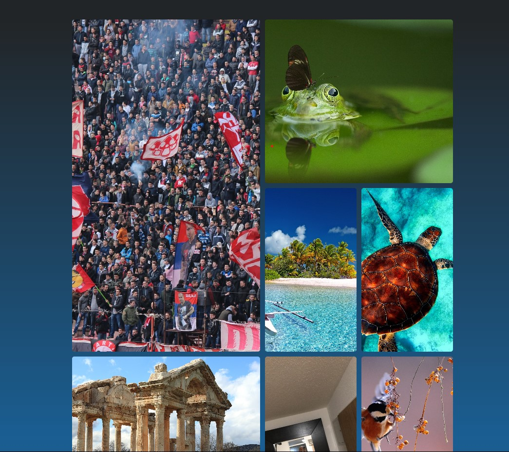

# Dokumentation Bildergalerie Modul 152 (https://matejasbildergalerie.netlify.app/)
## Bildformate
Es gibt verschiedene Bildformate, die alle ihre Vor- und Nachteile haben. Alle sind je nach Situation angebracht und doch kann man sagen, das die einen besser als die anderen sind. Ich habe in meiner Galerie nur jpg genutzt, weil ich dieses Format für so ein Projekt am passendsten fand. Mein Video ist im .mp4 Format.

Die bekanntesten Beispiele wären zum Beispiel: .jpg, .png, .svg und .gif.

<table>
  <thead>
    <tr>
      <th>Format</th>
      <th style= "text-align: center">Vorteile</th>
      <th style= "text-align: center">Nachteile</th>
    </tr>
  </thead>
  <tbody>
    <tr>
      <td><em><strong>.jpg</em></td>
      <td>alle Systeme, gebräuchlichstes Format</td>
      <td>keine Animation, Qualiverlust bei Komprimierung</td>
    </tr>
    <tr>
      <td><em><strong>.png</em></td>
      <td>Farben, transparente Hintergründe, </td>
      <td>nicht universell unterstützt, meist grösser als JPG</td>
    </tr>
    <tr>
      <td><em><strong>.svg</em></td>
      <td>geringe Grösse, für Symbole</td>
      <td>unmöglich Teil zu lesen nur ganzes, nicht universell</td>
    </tr>
    <tr>
      <td><em><strong>.gif</em></td>
      <td>Animation, gewährleistet sehr kleine Bildgrösse</td>
      <td>Nur 256 Farben, veraltet, gibt neuere Alternativen</td>
    </tr>
  </tbody>
</table>

## Bilder selber erstellen
Alle Bilder auf meiner Seite sind selbstgemacht. Nur das Video ist vom Internet. Könnte auch ein eigenes nehmen, aber liebe das Video. 

## Bilder anpassen
Kompressionsrate, Grösse, Farbtiefe, Formate und so weiter kann heutzutage am einfachsten Online gemacht werden. Einfach das eingeben was man gerade braucht und bam! man findet ein Tool.

## Darstellungsoptionen
Es gibt verschiedene Arten eine Galerie darzustellen. Eine Möglichkeit ist das Carousel, was ich jetzt in diesem Fall gemacht habe. Es gibt aber auch reguläre Galerien, durch die man scrolled. So wie auf dem Handy. 

Hier ein Beispiel vom zweiten:

Die ganze Galerie finden sie unter: https://matejamarkovic.netlify.app/galerie.html

## Manuell und automatisch Galerie abspielen
Ich hab es geschafft, das man die Galerie sowohl manuell als auch automatisch abspielen kann. Es fängt aber an Probleme zu machen, sobald man manuell abspielt. Die Slidegeschwindigkeit wird aufeinmal zu schnell und ich finde nicht heraus weshalb. Es fängt dann ebenfalls an sich sehr komisch zu verhalten und das manuelle Skippen, skipped dann mehrere Slides aufeinmal. Aus irgendeinem Grund startet die Galerie auch beim zweiten Bild, geht dann zum Ersten und von dort aus wieder normal weiter. Ich hab die automatische Slidefunktion für den Moment herauskommentiert. 

## Alternativen Text anzeigen
Der alternative Text wird beim Hovern über dem Bild angezeigt. Kleine Box erscheint beim Cursor.

## **Lernjournal**
### Planung
Ich fing mit dem Planen der Seite an, was mir keine grossen Probleme bereitete. Zuerst schaute ich mir verschiedene Möglichkeiten an, um die Slide-Funktion einzubauen. Es gab viel Auswahl. Also von purem HTML mit CSS, zu Javascript mit HTML und CSS und dann noch React-Komponenten, die eigentlich alles für einen erledigen.  Natürlich wollte ich den harten weg gehen und alles alleine machen, weshalb ich in diesem Projekt auch pur JS, HTML und CSS habe. Nur ein kleiner Spass. Wie jeder andere hoffte ich auf einen coolen React-Komponenten, denn ich dann nutzen kann. Ich fand auch einige, der beste davon war der Lightgallery Komponent. 

### Umsetzung
Doch wie es der Zufall will, hatte ich schlimme Probleme mit React. Ich konnte zuerst garkein Projekt erstellen. Dann konnte ich die Komponenten nicht installieren. Ich wechselte auf Vite, wo es zünachst funktionierte. Es ging alles gut, konnte die Komponenten hinzufügen und Bilder hineintun. Doch es wollte nichts darstellen auf der Webpage. Der return aus meinem Javascript File wurde nicht erkannt und konnte so auch nicht dargestellt werden. Ich war am verzweifeln. Als ich dann aus Frust alle meine Projektversuche gelöscht hatte, entschied ich mich dazu normal mit JS, HTML und CSS zu arbeiten. Das ging dann gut ohne grössere Probleme. Ich konnte gut arbeiten, Bilder einfügen, das Video hineinfügen und die Funktion vom swipen einbauen. Mit CSS konnte ich es auch noch sehr gut gestalten. Ich war also sehr zufrieden. Doch dann kam es. Ich fand heraus das ich das automatische abspielen hineinbauen muss. Und von der Logik her, ist es nicht so ein Problem. Ich musste mir zwar Online ein paar Referenzen heraussuchen, konnte es aber grösstenteils hinbekommen. Doch dann bemerkte ich, dass das automatische Abspielen nicht so kompatibel mit dem manuellen Abspielen ist. Also sobald ich auf die Pfeile klicke, fängt es an Probleme zu machen und überspringt Slides, man kann nicht mer manuell zurückgehen, die Slideshow läuft viel zu schnell oder viel zu langsam. Es ist sehr wahrscheinlich ein Problem mit dem slideIndex. Also der Variable die bestimmt welcher Slide gerade angezeigt wird. Doch ich konnte nicht herausfinden was genau das Problem ist. 

### Endergebnis
Deshalb ist es leider immernoch so in meiner Galerie. Das Manuelle funktioniert super, solange man die Funkton fürs automatische Abspielen, herauskommentiert und das automatische Abspielen funktioniert super, solange man nicht auf die Pfeile klickt. Ich hab die automatische Funktion mal drin gelassen. Es ist auf der Webseite also auch so. Ich wünschte ich hätte noch ein wenig Zeit um die Galerie zu verbessern. Aber naja, alles in allem bin ich relativ zufrieden mit dem Endergebnis. Es hätte aber definitiv besser sein können. Hätte ich nur von Anfang an mit Js gearbeitet, antstatt so lange an React und Vite zu verzweifeln. Bin selber schuld.

Hoffe die Galerie gefällt ihnen trotzdem.